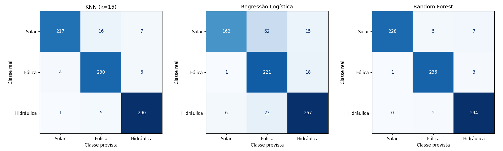
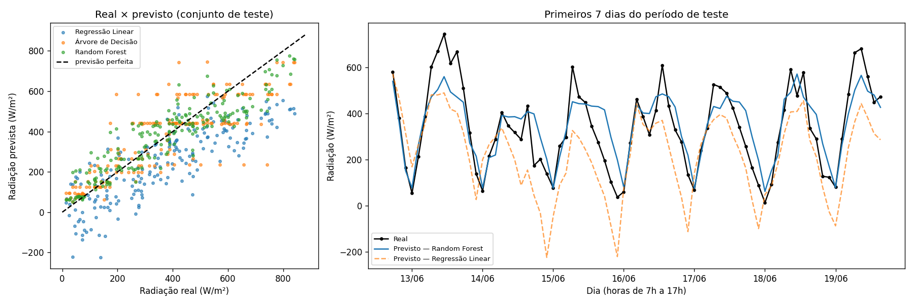

| Integrante | RM |
|---|---|
| João Victor Canello Ferian | RM573295 |
| Gustavo Melo dos Santos | RM573562 |
| João Pedro Costenari Silva | RM572260 |
| Lucas Klein | RM570029 |

# APIs de energia renovável e aprendizado de máquina

Avaliação (Checkpoint 02) — consulta a duas APIs públicas, preparação dos dados e comparação de **três algoritmos** em cada uma de **duas tarefas**:

1. **Classificação (ANEEL):** prever se um empreendimento é **Solar, Eólica ou Hidráulica** a partir da potência outorgada e da localização.
2. **Regressão (Open-Meteo):** estimar a **radiação solar horizontal (W/m²)** em Petrolina (PE) a partir de condições meteorológicas e da hora local.

## Fontes e período dos dados

| Tarefa | Fonte | Recorte |
|---|---|---|
| Classificação | [ANEEL — SIGA](https://dadosabertos.aneel.gov.br/dataset/siga-sistema-de-informacoes-de-geracao-da-aneel) (API CKAN/DataStore, recurso `11ec447d-698d-4ab8-977f-b424d5deee6a`) | Siglas UFV, EOL, UHE, PCH, CGH; até 1.200 registros por sigla; UHE+PCH+CGH = *Hidráulica* |
| Regressão | [Open-Meteo — Historical Weather API](https://open-meteo.com/en/docs/historical-weather-api) | Lat −9,39 / Lon −40,50; 01/04/2025 a 30/06/2025; horas locais das 7h às 17h (America/Recife) |

Nenhuma das APIs exige login, token ou chave.

## Estrutura do repositório

```
├── Aula_APIs_Energia_Renovavel_ML.ipynb   # notebook completo (APIs, análise, 6 modelos, conclusões)
├── aneel_classificacao_orange.csv         # dados da Tarefa 1 (gerado pelo notebook)
├── meteo_regressao_orange.csv             # dados da Tarefa 2 (gerado pelo notebook)
├── figuras/                               # gráficos e tabelas de resultados (gerados pelo notebook)
└── README.md
```

## Como executar

**Google Colab:** abra o notebook e use *Ambiente de execução → Executar tudo*.

**Localmente:**

```bash
pip install pandas numpy matplotlib scikit-learn jupyter
jupyter notebook Aula_APIs_Energia_Renovavel_ML.ipynb
```

Execute as células na ordem. As primeiras consultam as APIs e regravam os dois CSVs; as seções de análise leem esses CSVs (se não existirem, usam a cópia publicada no repositório da disciplina). Semente fixa: `42`.

## Metodologia

- **Classificação:** X = `log10(potencia_kw)`, `latitude`, `longitude`; y = `fonte`. Divisão estratificada 80/20. Padronização dentro de `Pipeline` (ajustada só no treino). Métricas por classe com média **macro**.
- **Regressão:** X = `temperatura_c`, `umidade_pct`, `nuvens_pct`, `vento_kmh`, `hora`; y = `radiacao_w_m2`. Divisão **temporal** (primeiras 80% das horas para treino, 20% finais para teste, sem embaralhar).
- Colunas que revelam o alvo (sigla, nome, CEG, combustível) e a própria radiação não foram usadas como entrada.

## Resultados

### Tarefa 1 — Classificação (teste com 776 empreendimentos)

| Modelo | Accuracy | Precision (macro) | Recall (macro) | F1 (macro) |
|---|---|---|---|---|
| KNN (k=15) | 0,950 | 0,950 | 0,947 | 0,948 |
| Regressão Logística | 0,839 | 0,857 | 0,834 | 0,834 |
| **Random Forest** | **0,977** | **0,978** | **0,976** | **0,977** |



**Escolha: Random Forest.** A confusão mais comum é Solar prevista como Eólica/Hidráulica (usinas solares de médio/grande porte nas mesmas regiões das outras fontes). Potência e localização não bastam numa aplicação real: a amostra tem proporções artificiais, há sobreposição geográfica e de potência entre fontes, as coordenadas são aproximadas e a expansão para novas regiões mudaria os padrões.

### Tarefa 2 — Regressão (teste: 12/06 a 30/06/2025, 201 horas)

| Modelo | MAE (W/m²) | MSE ((W/m²)²) | R² |
|---|---|---|---|
| Regressão Linear | 145,2 | 30.034 | 0,360 |
| Árvore de Decisão | 90,9 | 15.127 | 0,678 |
| **Random Forest** | **72,4** | **8.411** | **0,821** |



**Escolha: Random Forest.** A hora é o atributo mais importante (~50%), mas sua relação com a radiação tem forma de sino — por isso a Regressão Linear vai mal (chega a prever valores negativos). A radiação estimada (W/m², no plano horizontal) **não equivale à energia gerada** (kWh) por um sistema fotovoltaico, que depende de área, inclinação/orientação dos módulos, temperatura das células, inversor, sombreamento, sujeira e perdas.

> Os números acima vêm da execução feita com os dados consultados em outubro de 2026. A base da ANEEL é atualizada continuamente, então uma nova execução pode gerar valores levemente diferentes na Tarefa 1.
